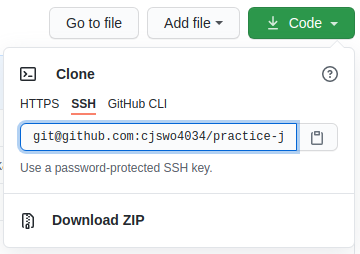

# Ubuntu 팁

## 환경변수 설정

1. alias 명령어로 변수 만들기

    ```shell
    1) sed -i '$aalias [변수명]="명령어"' ~/.zshrc
    2) source ~/.zshrc
    ```

   - trello 관련 변수
     - trcs : google-chrome https://trello.com/b/KTftSr0P/cs
     - trlog : google-chrome https://trello.com/b/zg7FpuoX/devlog
   - idea 관련 변수
     - idlog : idea.sh ~/nsm/project/devlog
     - iddoc : idea.sh ~/nsm/project/devlog
     - idjava : idea.sh ~/nsm/project/devlog
   - 기타
     - ws : cd ~/nsm/project

2. 환경변수 만들기
  
   - z쉘이 설정을 불러오는 순서 ([링크](https://wiki.archlinux.org/index.php/zsh#Startup.2FShutdown_files))
     1. zshenv
     2. zprofile
     3. zshrc
     4. zlogin

<br>

## Git username, password 없이 사용하기

1. 우분투에서 공개키 만들기 ([출처](https://proni.tistory.com/entry/%F0%9F%90%A7-Ubuntu-Git-username-password-%EC%97%86%EC%9D%B4-%EC%82%AC%EC%9A%A9%ED%95%98%EA%B8%B0))

    ```shell
    ssh-keygen -t rsa [-b bitsize]
    a) 공개키를 생성할 경로를 지정한다. 엔터치면 기본 경로에 만든다.
    b) 공개키를 사용할 때 묻는 비밀번호로 권장값은 10~30의 문자이고 생략가능하다.
    c) 비밀번호를 확인하는 단계로 b)에서 입력한 값을 입력한다.
    ```

    > 보안을 위해서 공개키를 만들고 chmod로 권한을 수정해야한다.
    >
    > 개인키 : ~/.ssh/id_rsa
    >
    > 공개키 : ~/.ssh/id_rsa.pub

2. git에서 ssh키 등록하기

   1. git 홈페이지에서 `Profile -> Setting -> SSH and GPG keys`탭으로 이동
   2. `New SSH key`를 클릭하고 Title과 Key 입력해서 SSH key를 등록한다.

        - Title은 아무거나 입력한다.
        - Key에는 1.에서 만든 공개키를 입력한다.

3. remote repository url 변경하기

   1. git의 project page에서 `use url`을 클릭한 다음 링크를 복사한다.

        

   2. local repository의 루트에서 터미널을 열고 다음 명령을 실행한다.

        ```shell
        git remote set-url origin [ssh url]  # (clone한 경우)
        git clone [ssh url]                  # (clone하지 않은 경우)
        ```

   3. 비밀번호를 묻는다면 공개키를 만들 때 입력했던 passphrase값을 입력한다.

<br>

## 기타

### 명령어

- deb파일 설치하기 : `sudo dpkg -i (deb file)`

### 커맨드

- 터미널
  - 터미널 열기 : `ctrl + alt + t`
- 애플리케이션
  - 전체 목록 열기 : `super + a`
