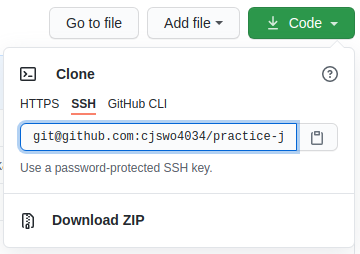

# Ubuntu 팁

## 환경변수 설정

1. alias 명령어로 변수 만들기

    ```shell
    1) alias [변수명]='명령어'
    2) source ~/.zshrc
    ```

2. 환경변수 만들기

## Git username, password 없기 사용하기

1. 우분투에서 공개키 만들기

    ```shell
    ssh-keygen -t rsa [-b bitsize]
    a) 공개키를 생성할 경로를 지정한다. 엔터치면 기본 경로에 만든다.
    b) 시드값 같은 역할. 권장값은 10~30의 숫자이고 생략가능하다.
        공개키를 사용할 때 비밀번호를 물을 때 이 값을 입력하면 된다.
    c) 비밀번호를 확인하는 단계로 b)에서 입력한 값을 입력한다.
    ```

    > 보안을 위해서 공개키를 만들고 chmod로 권한을 수정해야한다.
    > 개인키 : ~/.ssh/id_rsa
    > 공개키 : ~/.ssh/id_rsa.pub

2. git에서 ssh키 등록하기

   1. git 홈페이지에서 `Profile -> Setting -> SSH and GPG keys`탭으로 이동
   2. `New SSH key`를 클릭하고 Title과 Key 입력해서 SSH key를 등록한다.

        - Title은 아무거나 입력한다.
        - Key에는 1.에서 만든 공개키를 입력한다.

3. remote repository url 변경하기

   1. git의 project page에서 `use url`을 클릭한 다음 링크를 복사한다.
        
   2. local repository의 루트에서 터미널을 열고 다음 명령을 실행한다.

        ```shell
        git remote set-url origin [ssh url]  # (clone한 경우)
        git clone [ssh url]                  # (clone하지 않은 경우)
        ```

   3. 비밀번호를 묻는다면 공개키를 만들 때 입력했던 passphrase값을 입력한다.
